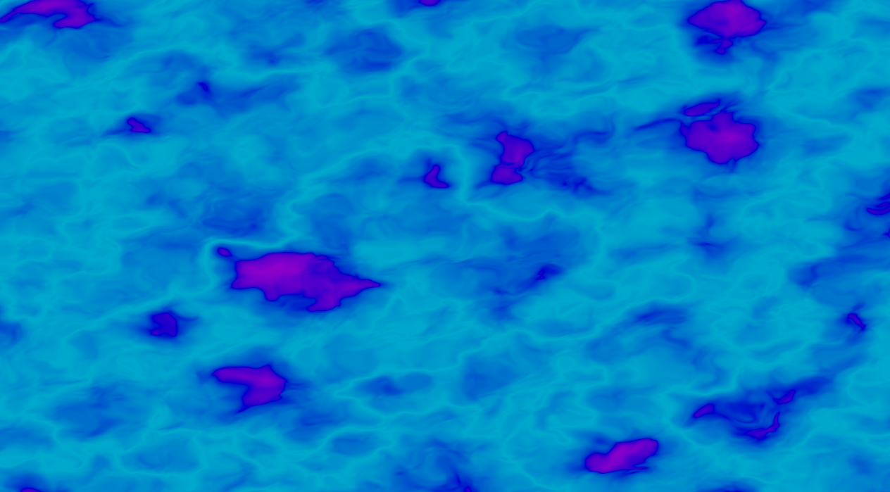
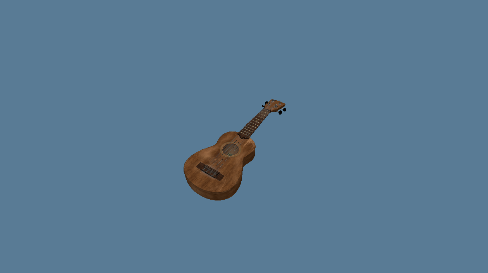

# QuantumVkExamples
A series of examples for the QuantumVk vulkan abstraction library.

# List of examples

[Basic Noise](examples/noise) Simple application that creates a randomly generated scrolling noise effect.

[Mesh Viewer](examples/mesh_viewer) Application that loads a mesh and diffuse texture file and displays it on screen, in 3D.

